# 电商商品推荐系统架构设计

## 一、系统概览

本系统是一个基于多模态对比学习和深度学习的电商商品推荐系统，主要包含以下四大核心模块：

| 模块 | 技术 | 说明 |
|------|------|------|
| CLIP多模态对齐 | CLIP (ViT-B/32) | 图文语义空间对齐 |
| 召回+排序两阶段 | FAISS + DIN + LambdaMART | 高效召回与精细排序 |
| Octopus用户建模 | 多兴趣表示 | 类八爪鱼的多臂抓取 |
| LLM用户交互 | GLM | 自然语言意图理解 |

---

## 二、系统总设计框图

### 2.1 整体架构图

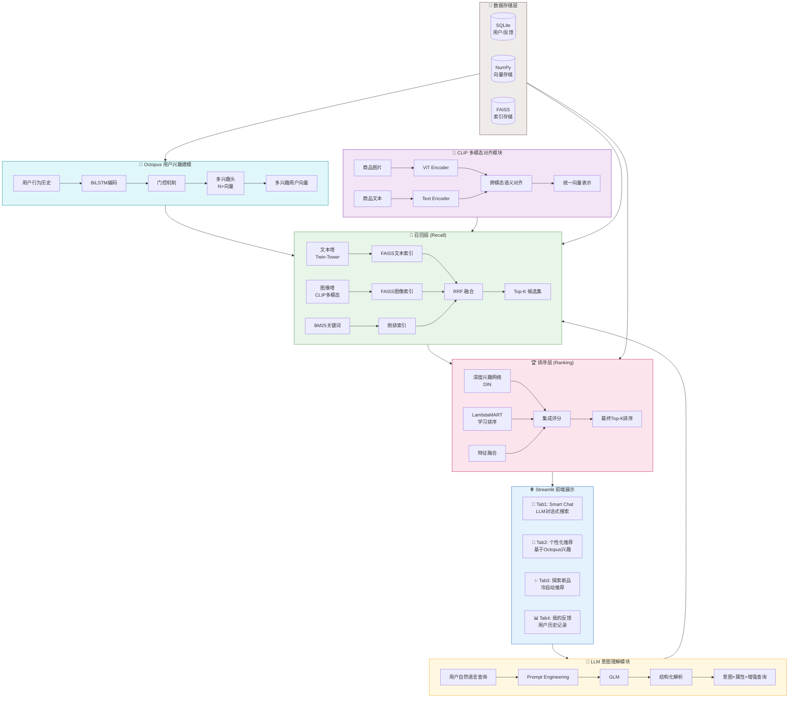
```mermaid
graph TB
    %% ==================== 前端展示层 ====================
    subgraph FRONTEND["🌐 Streamlit 前端展示"]
        TAB1[📱 Tab1: Smart Chat<br/>LLM对话式搜索]
        TAB2[👤 Tab2: 个性化推荐<br/>基于Octopus兴趣]
        TAB3[✨ Tab3: 探索新品<br/>冷启动推荐]
        TAB4[📊 Tab4: 我的反馈<br/>用户历史记录]
    end

    %% ==================== 用户意图理解 ====================
    subgraph INTENT["🧠 LLM 意图理解模块"]
        QUERY[用户自然语言查询]
        LLM[GLM]
        PROMPT[Prompt Engineering]
        PARSE[结构化解析]

        QUERY --> PROMPT
        PROMPT --> LLM
        LLM --> PARSE
        PARSE --> INTENTS[意图+属性+增强查询]
    end

    %% ==================== CLIP多模态对齐 ====================
    subgraph CLIP["🎨 CLIP 多模态对齐模块"]
        IMG[商品图片]
        TXT[商品文本]

        VIT[ViT Encoder]
        TEXT_ENC[Text Encoder]

        IMG --> VIT
        TXT --> TEXT_ENC

        VIT --> ALIGN[跨模态语义对齐]
        TEXT_ENC --> ALIGN
        ALIGN --> VECTORS[统一向量表示]
    end

    %% ==================== 召回层 ====================
    subgraph RECALL["📡 召回层 (Recall)"]
        TEXT_TOWER[文本塔<br/>Twin-Tower]
        IMG_TOWER[图像塔<br/>CLIP多模态]
        BM25[BM25关键词]

        TEXT_TOWER --> FAISS_T[FAISS文本索引]
        IMG_TOWER --> FAISS_I[FAISS图像索引]
        BM25 --> BM25_IDX[倒排索引]

        FAISS_T --> RRF[RRF 融合]
        FAISS_I --> RRF
        BM25_IDX --> RRF

        RRF --> CAND[Top-K 候选集]
    end

    %% ==================== 排序层 ====================
    subgraph RANK["🏆 排序层 (Ranking)"]
        DIN[深度兴趣网络<br/>DIN]
        MART[LambdaMART<br/>学习排序]
        FUSION[特征融合]

        DIN --> SCORE[集成评分]
        MART --> SCORE
        FUSION --> SCORE

        SCORE --> FINAL[最终Top-K排序]
    end

    %% ==================== Octopus用户建模 ====================
    subgraph OCTO["🐙 Octopus 用户兴趣建模"]
        HISTORY[用户行为历史]
        LSTM[BiLSTM编码]
        GATE[门控机制]
        HEADS[多兴趣头<br/>N×向量]

        HISTORY --> LSTM
        LSTM --> GATE
        GATE --> HEADS

        HEADS --> USER_VEC[多兴趣用户向量]
    end

    %% ==================== 数据存储 ====================
    subgraph STORAGE["💾 数据存储层"]
        SQL[(SQLite<br/>用户/反馈)]
        NP[(NumPy<br/>向量存储)]
        FAISS[(FAISS<br/>索引存储)]
    end

    %% ==================== 连接关系 ====================
    FRONTEND --> INTENT
    INTENT --> RECALL
    RECALL --> RANK
    RANK --> FRONTEND

    OCTO --> RECALL
    CLIP --> RECALL
    STORAGE --> OCTO
    STORAGE --> RECALL
    STORAGE --> RANK

    %% 样式
    style FRONTEND fill:#e3f2fd,stroke:#1565c0
    style INTENT fill:#fff8e1,stroke:#f9a825
    style CLIP fill:#f3e5f5,stroke:#7b1fa2
    style RECALL fill:#e8f5e9,stroke:#388e3c
    style RANK fill:#fce4ec,stroke:#c2185b
    style OCTO fill:#e0f7fa,stroke:#00838f
    style STORAGE fill:#efebe9,stroke:#5d4037
```

---

### 2.2 模块交互关系图

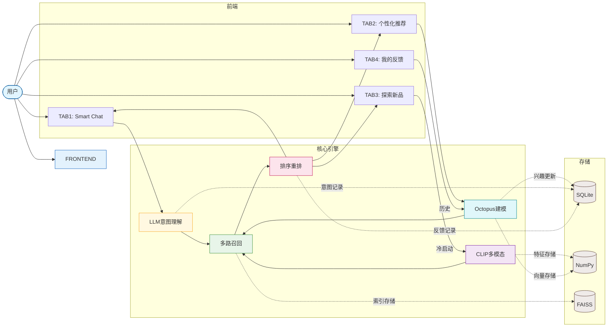
```mermaid
graph LR
    %% 用户交互
    USER([用户]) --> FRONTEND

    subgraph 前端
        TAB1[TAB1: Smart Chat]
        TAB2[TAB2: 个性化推荐]
        TAB3[TAB3: 探索新品]
        TAB4[TAB4: 我的反馈]
    end

    subgraph 核心引擎
        LLM[LLM意图理解]
        CLIP[CLIP多模态]
        RECALL[多路召回]
        RANK[排序重排]
        OCTO[Octopus建模]
    end

    subgraph 存储
        SQL[(SQLite)]
        NP[(NumPy)]
        FAISS[(FAISS)]
    end

    %% 交互流
    USER --> TAB1
    USER --> TAB2
    USER --> TAB3
    USER --> TAB4

    TAB1 --> LLM
    TAB2 --> OCTO
    TAB3 -->|冷启动| CLIP
    TAB4 -->|历史| OCTO

    LLM --> RECALL
    CLIP --> RECALL
    OCTO --> RECALL

    RECALL --> RANK
    RANK --> TAB1
    RANK --> TAB2
    RANK --> TAB3

    OCTO -.->|兴趣更新| SQL
    LLM -.->|意图记录| SQL
    RANK -.->|反馈记录| SQL

    CLIP -.->|特征存储| NP
    OCTO -.->|向量存储| NP
    RECALL -.->|索引存储| FAISS

    %% 样式
    style USER fill:#e1f5ff,stroke:#01579b
    style FRONTEND fill:#e3f2fd,stroke:#1565c0
    style LLM fill:#fff8e1,stroke:#f9a825
    style CLIP fill:#f3e5f5,stroke:#7b1fa2
    style RECALL fill:#e8f5e9,stroke:#388e3c
    style RANK fill:#fce4ec,stroke:#c2185b
    style OCTO fill:#e0f7fa,stroke:#00838f
    style SQL fill:#efebe9,stroke:#5d4037
    style NP fill:#efebe9,stroke:#5d4037
    style FAISS fill:#efebe9,stroke:#5d4037
```

---

### 2.3 数据流向图

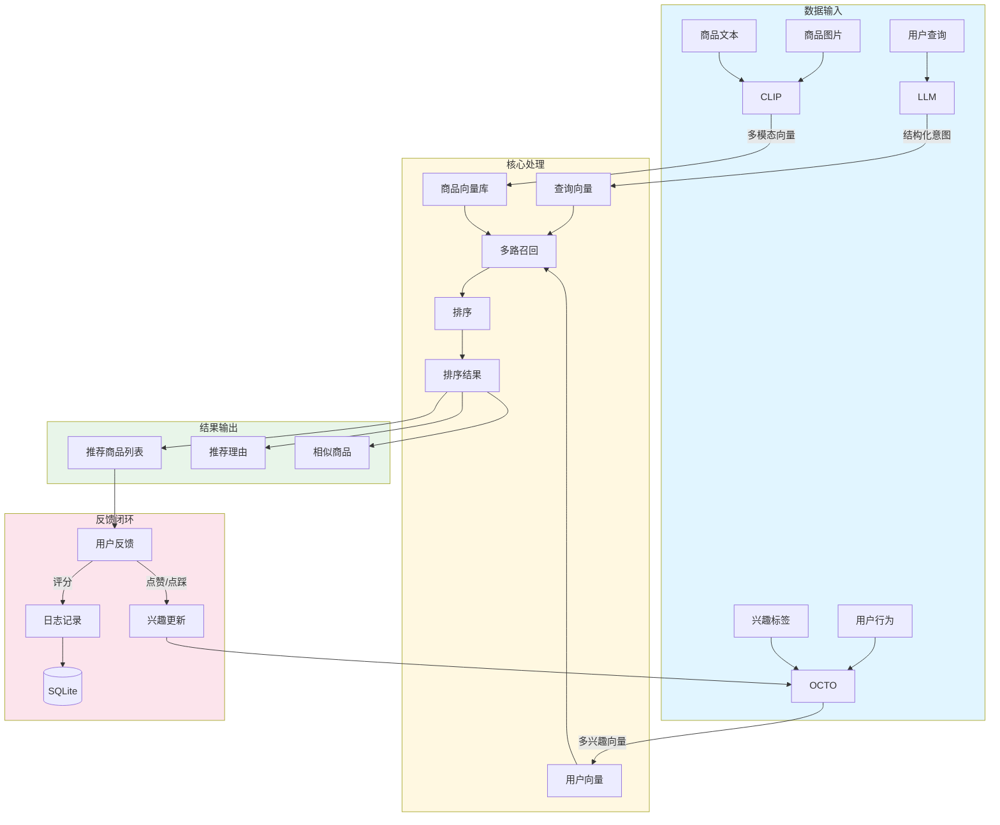
```mermaid
flowchart TB
    subgraph INPUT[数据输入]
        U1[用户查询] --> LLM
        U2[用户行为] --> OCTO
        U3[兴趣标签] --> OCTO
        P1[商品图片] --> CLIP
        P2[商品文本] --> CLIP
    end

    subgraph PROCESS[核心处理]
        LLM -->|结构化意图| Q[查询向量]
        CLIP -->|多模态向量| V[商品向量库]
        OCTO -->|多兴趣向量| U[用户向量]

        Q --> RECALL[多路召回]
        V --> RECALL
        U --> RECALL

        RECALL --> RANK[排序]
        RANK --> OUT[排序结果]
    end

    subgraph OUTPUT[结果输出]
        OUT --> R1[推荐商品列表]
        OUT --> R2[推荐理由]
        OUT --> R3[相似商品]
    end

    subgraph FEEDBACK[反馈闭环]
        R1 --> FB[用户反馈]
        FB -->|点赞/点踩| UPDATE[兴趣更新]
        FB -->|评分| LOG[日志记录]
        UPDATE --> OCTO
        LOG --> SQL[(SQLite)]
    end

    %% 样式
    style INPUT fill:#e1f5ff
    style PROCESS fill:#fff8e1
    style OUTPUT fill:#e8f5e9
    style FEEDBACK fill:#fce4ec
```

---

### 2.4 技术架构层次图

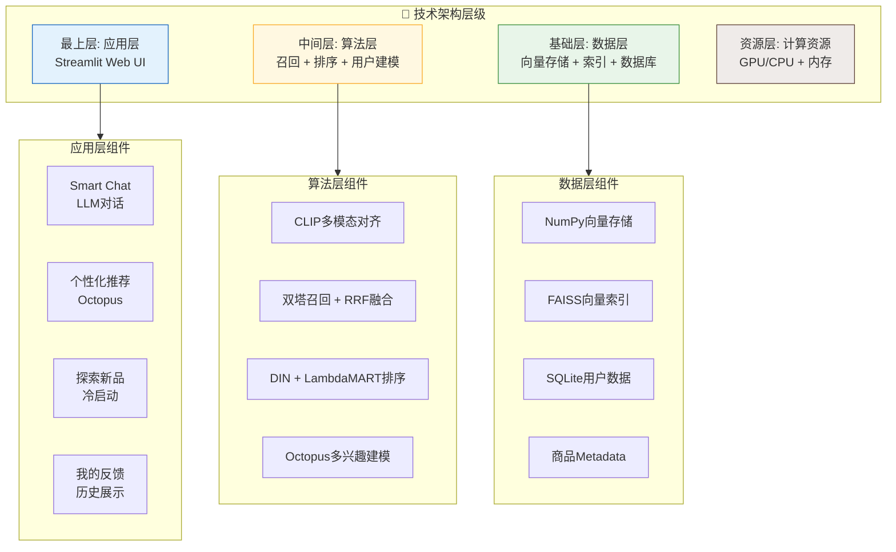
```mermaid
graph TB
    subgraph T1[🥞 技术架构层级]
        direction TB
        L1["最上层: 应用层<br/>Streamlit Web UI"]
        L2["中间层: 算法层<br/>召回 + 排序 + 用户建模"]
        L3["基础层: 数据层<br/>向量存储 + 索引 + 数据库"]
        L4["资源层: 计算资源<br/>GPU/CPU + 内存"]
    end

    subgraph L1_DETAIL["应用层组件"]
        APP1[Smart Chat<br/>LLM对话]
        APP2[个性化推荐<br/>Octopus]
        APP3[探索新品<br/>冷启动]
        APP4[我的反馈<br/>历史展示]
    end

    subgraph L2_DETAIL["算法层组件"]
        ALGO1[CLIP多模态对齐]
        ALGO2[双塔召回 + RRF融合]
        ALGO3[DIN + LambdaMART排序]
        ALGO4[Octopus多兴趣建模]
    end

    subgraph L3_DETAIL["数据层组件"]
        DATA1[NumPy向量存储]
        DATA2[FAISS向量索引]
        DATA3[SQLite用户数据]
        DATA4[商品Metadata]
    end

    L1 --> L1_DETAIL
    L2 --> L2_DETAIL
    L3 --> L3_DETAIL

    style L1 fill:#e3f2fd,stroke:#1565c0
    style L2 fill:#fff8e1,stroke:#f9a825
    style L3 fill:#e8f5e9,stroke:#388e3c
    style L4 fill:#efebe9,stroke:#5d4037
```

---

## 三、四大核心模块详解
graph TD
    %% 入口
    START([用户打开应用]) --> LOAD[Streamlit 加载资源<br/>数据加载 & 模型初始化]

    %% 用户认证分支
    LOAD --> AUTH{是否登录?}
    AUTH -->|是| GET_USER[获取用户信息]
    AUTH -->|否| CONTINUE1[继续作为游客]

    %% 主流程分支
    GET_USER --> TABS{选择功能}
    CONTINUE1 --> TABS

    %% 三大功能模块
    TABS -->|Smart Chat| CHAT_START[用户输入自然语言]
    TABS -->|个性化推荐| REC_START[获取用户兴趣]
    TABS -->|探索新品| EXPLORE_START[多品类探索]

    %% ========== Smart Chat 流程 ==========
    CHAT_START --> CHAT_LLM[LLM 解析意图<br/>Query Understanding]
    CHAT_LLM --> CHAT_STRUCT[结构化查询输出<br/>category/attributes/enhanced_query]
    CHAT_STRUCT --> CHAT_RECALL[多路召回]
    CHAT_RECALL --> CHAT_RRF[RRF 融合]
    CHAT_RRF --> CHAT_RANK[排序重排<br/>DIN + LambdaMART]
    CHAT_RANK --> CHAT_RESULT[展示推荐结果<br/>生成推荐理由]

    %% ========== 个性化推荐 流程 ==========
    REC_START --> REC_OCTOPUS[Octopus 多兴趣向量]
    REC_OCTOPUS --> REC_RECALL[基于兴趣召回]
    REC_RECALL --> REC_FILTER[过滤已反馈商品]
    REC_FILTER --> REC_RANK[排序]
    REC_RANK --> REC_RESULT[展示推荐结果]

    %% ========== 探索新品 流程 ==========
    EXPLORE_START --> EXP_DIVERSE[多品类采样]
    EXP_DIVERSE --> EXP_RANK[排序]
    EXP_RANK --> EXP_RESULT[展示多样化商品]

    %% 用户反馈循环
    CHAT_RESULT --> FEEDBACK
    REC_RESULT --> FEEDBACK
    EXP_RESULT --> FEEDBACK

    FEEDBACK{用户反馈}
    FEEDBACK -->|👍 点赞| FEED_LIKE[记录点赞<br/>更新兴趣权重]
    FEEDBACK -->|👎 不喜欢| FEED_DISLIKE[记录不喜欢]
    FEEDBACK -->|⭐ 评分| FEED_RATE[记录评分]

    FEED_LIKE --> UPDATE[interest_updater<br/>实时更新兴趣]
    FEED_DISLIKE --> UPDATE
    FEED_RATE --> UPDATE
    UPDATE --> TABS

    %% 样式
    style START fill:#e1f5ff,stroke:#01579b
    style TABS fill:#fff3e0,stroke:#ff9800
    style CHAT_RESULT fill:#e8f5e9,stroke:#388e3c
    style REC_RESULT fill:#e8f5e9,stroke:#388e3c
    style EXP_RESULT fill:#e8f5e9,stroke:#388e3c
    style FEEDBACK fill:#fce4ec,stroke:#c2185b
```

---

### 2.2 CLIP多模态对齐流程

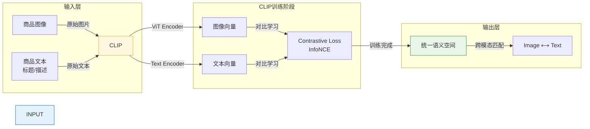
```mermaid
graph LR
    subgraph 输入层
        IMG[商品图像] -->|原始图片| CLIP
        TXT[商品文本<br/>标题/描述] -->|原始文本| CLIP
    end

    subgraph CLIP训练阶段
        CLIP -->|ViT Encoder| VEC_IMG[图像向量]
        CLIP -->|Text Encoder| VEC_TXT[文本向量]
        VEC_IMG -->|对比学习| LOSS[Contrastive Loss<br/>InfoNCE]
        VEC_TXT -->|对比学习| LOSS
    end

    subgraph 输出层
        LOSS -->|训练完成| SEMANTIC[统一语义空间]
        SEMANTIC -->|跨模态匹配| MATCH[Image ⟷ Text]
    end

    style INPUT fill:#e3f2fd,stroke:#1565c0
    style CLIP fill:#fff8e1,stroke:#f9a825
    style SEMANTIC fill:#e8f5e9,stroke:#388e3c
```

---

### 2.3 召回+排序两阶段流程

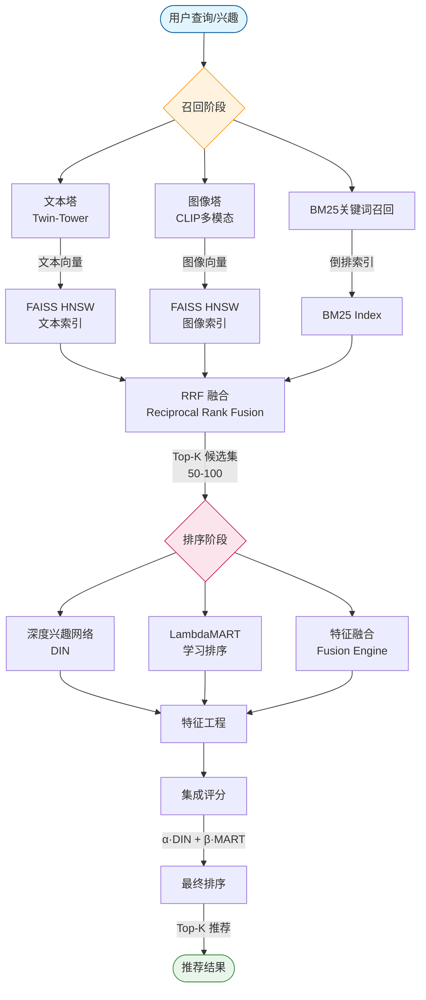
```mermaid
graph TD
    %% 输入
    QUERY([用户查询/兴趣]) --> RECALL{召回阶段}

    %% 召回层
    RECALL --> TEXT_TOWER[文本塔<br/>Twin-Tower]
    RECALL --> IMAGE_TOWER[图像塔<br/>CLIP多模态]
    RECALL --> BM25[BM25关键词召回]

    TEXT_TOWER -->|文本向量| FAISS_TEXT[FAISS HNSW<br/>文本索引]
    IMAGE_TOWER -->|图像向量| FAISS_IMG[FAISS HNSW<br/>图像索引]
    BM25 -->|倒排索引| BM25_INDEX[BM25 Index]

    FAISS_TEXT --> RRF[RRF 融合<br/>Reciprocal Rank Fusion]
    FAISS_IMG --> RRF
    BM25_INDEX --> RRF

    RRF -->|Top-K 候选集<br/>50-100| RANK{排序阶段}

    %% 排序层
    RANK --> DIN[深度兴趣网络<br/>DIN]
    RANK --> MART[LambdaMART<br/>学习排序]
    RANK --> FUSION[特征融合<br/>Fusion Engine]

    DIN --> FEATURES[特征工程]
    MART --> FEATURES
    FUSION --> FEATURES

    FEATURES --> SCORE[集成评分]
    SCORE -->|α·DIN + β·MART| FINAL[最终排序]

    FINAL -->|Top-K 推荐| RESULT([推荐结果])

    %% 样式
    style QUERY fill:#e1f5ff,stroke:#01579b
    style RECALL fill:#fff3e0,stroke:#ff9800
    style RANK fill:#fce4ec,stroke:#c2185b
    style RESULT fill:#e8f5e9,stroke:#388e3c
```

---

### 2.4 Octopus用户兴趣建模流程

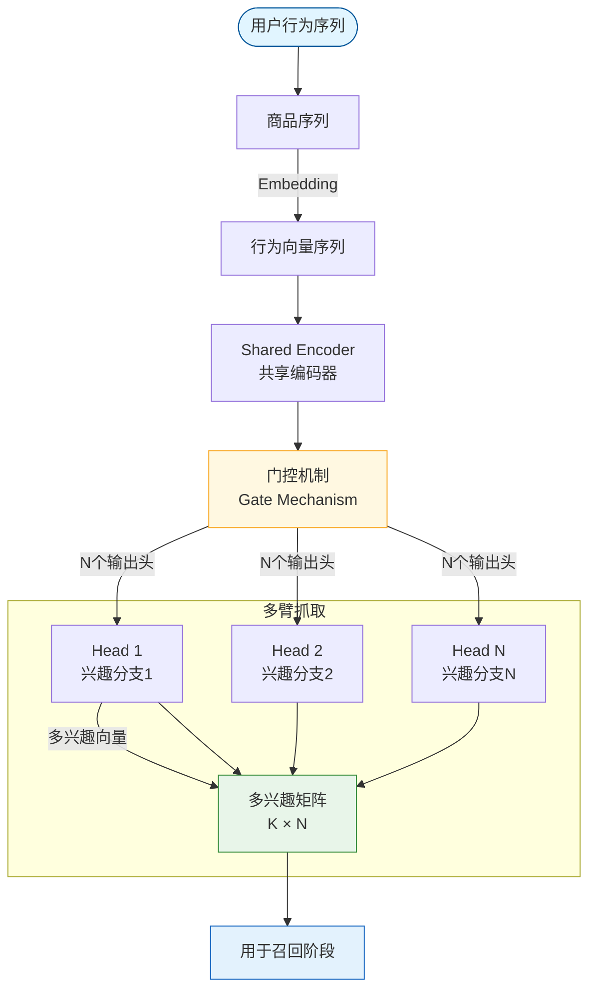
```mermaid
graph TD
    START([用户行为序列]) --> SEQ[商品序列]

    SEQ -->|Embedding| EMBEDS[行为向量序列]
    EMBEDS --> ENCODER[Shared Encoder<br/>共享编码器]

    ENCODER --> GATE[门控机制<br/>Gate Mechanism]

    GATE -->|N个输出头| HEAD1[Head 1<br/>兴趣分支1]
    GATE -->|N个输出头| HEAD2[Head 2<br/>兴趣分支2]
    GATE -->|N个输出头| HEADN[Head N<br/>兴趣分支N]

    HEAD1 -->|多兴趣向量| INTEREST_MATRIX[多兴趣矩阵<br/>K × N]

    subgraph 多臂抓取
        HEAD1 & HEAD2 & HEADN --> INTEREST_MATRIX
    end

    INTEREST_MATRIX --> RECALL[用于召回阶段]

    %% 样式
    style START fill:#e1f5ff,stroke:#01579b
    style GATE fill:#fff8e1,stroke:#f9a825
    style INTEREST_MATRIX fill:#e8f5e9,stroke:#388e3c
    style RECALL fill:#e3f2fd,stroke:#1565c0
```

---

### 2.5 LLM用户交互流程

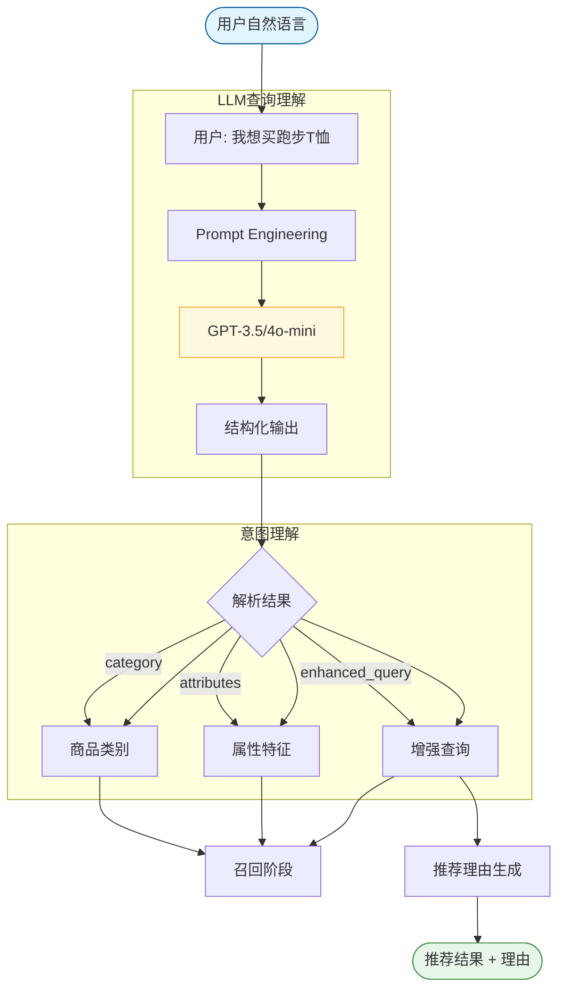
```mermaid
graph TD
    USER([用户自然语言]) --> INPUT

    subgraph LLM查询理解
        INPUT["用户: 我想买跑步T恤"] --> PROMPT[Prompt Engineering]
        PROMPT --> LLM[GPT-3.5/4o-mini]
        LLM --> OUTPUT[结构化输出]
    end

    OUTPUT --> PARSE{解析结果}
    PARSE -->|category| CAT[商品类别]
    PARSE -->|attributes| ATTR[属性特征]
    PARSE -->|enhanced_query| QUERY[增强查询]

    CAT & ATTR & QUERY --> RECALL[召回阶段]
    QUERY --> EXPLAIN[推荐理由生成]

    subgraph 意图理解
        PARSE --> CAT
        PARSE --> ATTR
        PARSE --> QUERY
    end

    EXPLAIN --> RESULT([推荐结果 + 理由])

    %% 样式
    style USER fill:#e1f5ff,stroke:#01579b
    style LLM fill:#fff8e1,stroke:#f9a825
    style RESULT fill:#e8f5e9,stroke:#388e3c
```

---

### 2.6 数据存储架构

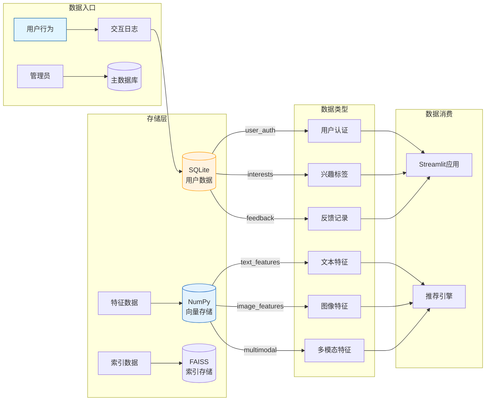
```mermaid
graph LR
    subgraph 数据入口
        USER_ACT[用户行为] --> LOG[交互日志]
        ADMIN[管理员] --> MASTER[(主数据库)]
    end

    subgraph 存储层
        LOG --> SQL[(SQLite<br/>用户数据)]
        FEATURES[特征数据] --> NP[(NumPy<br/>向量存储)]
        INDEX[索引数据] --> FAISS[(FAISS<br/>索引存储)]
    end

    subgraph 数据类型
        SQL --> |user_auth| AUTH[用户认证]
        SQL --> |interests| INTEREST[兴趣标签]
        SQL --> |feedback| FEEDBACK[反馈记录]
        NP --> |text_features| TEXT[文本特征]
        NP --> |image_features| IMAGE[图像特征]
        NP --> |multimodal| MULTI[多模态特征]
    end

    subgraph 数据消费
        AUTH & INTEREST & FEEDBACK --> APP[Streamlit应用]
        TEXT & IMAGE & MULTI --> REC_ENGINE[推荐引擎]
    end

    %% 样式
    style USER_ACT fill:#e1f5ff,stroke:#01579b
    style SQL fill:#fff3e0,stroke:#ff9800
    style NP fill:#e3f2fd,stroke:#1565c0
```

---

## 三、系统工作流程

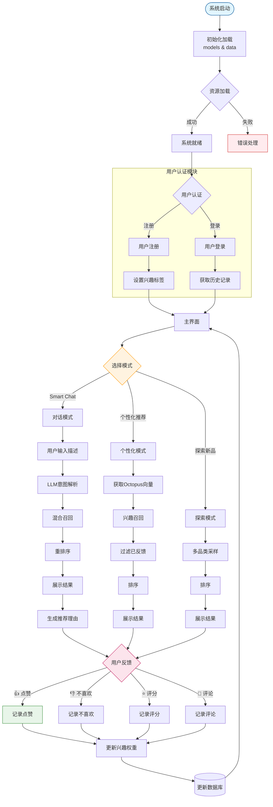
```mermaid
graph TD
    START([系统启动]) --> INIT[初始化加载<br/>models & data]

    INIT --> LOAD{资源加载}
    LOAD -->|成功| READY[系统就绪]
    LOAD -->|失败| ERROR[错误处理]

    READY --> AUTH{用户认证}

    subgraph 用户认证模块
        AUTH -->|登录| LOGIN[用户登录]
        AUTH -->|注册| REGISTER[用户注册]
        REGISTER --> SET_INTEREST[设置兴趣标签]
        LOGIN --> GET_HISTORY[获取历史记录]
    end

    SET_INTEREST & GET_HISTORY --> MAIN[主界面]

    MAIN --> MODE{选择模式}

    %% Smart Chat 模式
    MODE -->|Smart Chat| CHAT[对话模式]
    CHAT --> CHAT_INPUT[用户输入描述]
    CHAT_INPUT --> LLM_PARSE[LLM意图解析]
    LLM_PARSE --> HYBRID_RECALL[混合召回]
    HYBRID_RECALL --> RERANK[重排序]
    RERANK --> SHOW_RESULT[展示结果]
    SHOW_RESULT --> REASON[生成推荐理由]
    REASON --> FEEDBACK

    %% 个性化推荐 模式
    MODE -->|个性化推荐| PERSONAL[个性化模式]
    PERSONAL --> GET_OCTOPUS[获取Octopus向量]
    GET_OCTOPUS --> INTEREST_RECALL[兴趣召回]
    INTEREST_RECALL --> FILTER[过滤已反馈]
    FILTER --> PERSONAL_RANK[排序]
    PERSONAL_RANK --> PERSONAL_SHOW[展示结果]
    PERSONAL_SHOW --> FEEDBACK

    %% 探索新品 模式
    MODE -->|探索新品| EXPLORE[探索模式]
    EXPLORE --> DIVERSE[多品类采样]
    DIVERSE --> DIVERSE_RANK[排序]
    DIVERSE_RANK --> DIVERSE_SHOW[展示结果]
    DIVERSE_SHOW --> FEEDBACK

    %% 用户反馈循环
    FEEDBACK{用户反馈}
    FEEDBACK -->|👍 点赞| LIKE[记录点赞]
    FEEDBACK -->|👎 不喜欢| DISLIKE[记录不喜欢]
    FEEDBACK -->|⭐ 评分| RATE[记录评分]
    FEEDBACK -->|📝 评论| COMMENT[记录评论]

    LIKE --> UPDATE[更新兴趣权重]
    DISLIKE --> UPDATE
    RATE --> UPDATE
    COMMENT --> UPDATE

    UPDATE --> INTEREST_DB[(更新数据库)]
    INTEREST_DB --> MAIN

    %% 样式
    style START fill:#e1f5ff,stroke:#01579b
    style MODE fill:#fff3e0,stroke:#ff9800
    style FEEDBACK fill:#fce4ec,stroke:#c2185b
    style LIKE fill:#e8f5e9,stroke:#388e3c
    style ERROR fill:#ffebee,stroke:#d32f2f
```

---

## 四、核心技术栈

| 层级 | 技术 | 说明 |
|------|------|------|
| **前端展示** | Streamlit | 交互式Web界面 |
| **多模态对齐** | CLIP (ViT-B/32) | 图文语义空间对齐 |
| **向量检索** | FAISS (HNSW) | 高效向量相似度检索 |
| **关键词检索** | BM25 | 稀疏文本检索 |
| **双塔召回** | Twin-Tower | 用户-商品匹配召回 |
| **深度排序** | DIN | 深度兴趣网络 |
| **学习排序** | LambdaMART | 梯度提升排序 |
| **用户建模** | Octopus | 多兴趣表示学习 |
| **意图理解** | GPT-3.5/4o-mini | 自然语言意图解析 |
| **数据存储** | SQLite | 关系型数据存储 |
| **向量存储** | NumPy (.npy) | 高维向量持久化 |

---

## 五、项目文件结构

```
recommendation/
│
├── app.py                              # Streamlit 主应用入口
├── data_config.py                      # 数据路径和配置
│
├── ════════════════════════════════════════════════════════════════════════
├──                        多模态对齐模块
├── ════════════════════════════════════════════════════════════════════════
│
├── clip_training.py                    # CLIP 对比训练脚本
├── generate_multimodal_features_v2.py   # 多模态特征生成
├── models/                             # 预训练模型目录
│   ├── clip-vit-base-patch32/         # CLIP 视觉编码器
│   └── paraphrase-MiniLM-L3-v2/        # Sentence-BERT 文本编码器
│
├── ════════════════════════════════════════════════════════════════════════
├──                           召回模块
├── ════════════════════════════════════════════════════════════════════════
│
├── recall_faiss_v2.py                  # 双塔 FAISS 召回实现
├── hybrid_recall_v3.py                 # 混合召回融合 (RRF)
├── bm25_baseline.py                    # BM25 关键词召回
├── build_faiss_hnsw_v2.py             # FAISS HNSW 索引构建
│
├── ════════════════════════════════════════════════════════════════════════
├──                           排序模块
├── ════════════════════════════════════════════════════════════════════════
│
├── ranking_model.py                    # 排序模型主类
├── ranking_model_v3.py                 # 排序模型 v3
├── din_ranking_model.py               # DIN 深度兴趣网络
├── lambdamart_ranker.py               # LambdaMART 排序器
├── lambdamart_features.py              # LambdaMART 特征工程
├── train_lambdamart.py                 # LambdaMART 模型训练
│
├── ════════════════════════════════════════════════════════════════════════
├──                         用户建模模块
├── ════════════════════════════════════════════════════════════════════════
│
├── user_model.py                      # Octopus 用户模型
├── interest_updater.py                 # 用户兴趣动态更新
├── cold_start.py                       # 冷启动推荐
├── user_vector_store.py                # 用户向量存储
│
├── ════════════════════════════════════════════════════════════════════════
├──                          LLM 模块
├── ════════════════════════════════════════════════════════════════════════
│
├── llm_service.py                     # LLM 服务封装
├── llm_query_understanding.py         # 查询理解模块
│
├── ════════════════════════════════════════════════════════════════════════
├──                         数据处理模块
├── ════════════════════════════════════════════════════════════════════════
│
├── prepare_amazon_reviews23.py          # Amazon 数据集准备
├── generate_bert_features.py           # BERT 特征生成
├── augment_data.py                      # 数据增强
├── amazon_dataset_paths.py              # 数据路径配置
│
├── ════════════════════════════════════════════════════════════════════════
├──                         评估模块
├── ════════════════════════════════════════════════════════════════════════
│
├── evaluation.py                       # 评估主脚本
├── eval_bert_vs_our.py                # BERT vs 本文对比评估
├── eval_optimized.py                   # 优化评估
├── final_eval_v3.py                    # 最终评估 v3
├── run_evaluation.py                   # 评估运行脚本
│
├── ════════════════════════════════════════════════════════════════════════
├──                        用户交互模块
├── ════════════════════════════════════════════════════════════════════════
│
├── user_auth.py                       # 用户认证系统
├── user_feedback.py                    # 用户反馈记录
│
├── ════════════════════════════════════════════════════════════════════════
├──                          其他工具
├── ════════════════════════════════════════════════════════════════════════
│
├── fusion_utils.py                    # 特征融合工具
├── visualize.py                       # 可视化工具
├── check_progress.py                   # 进度检查
├── struct.md                           # 本架构文档
└── error_check.md                      # 错误检查记录
```

---

## 六、关键算法说明

### 6.1 RRF (Reciprocal Rank Fusion)

```python
# RRF 融合公式
score(item) = Σ 1 / (k + rank_i(item))

# 其中:
# - k: 融合参数 (通常取 30-60)
# - rank_i(item): 该商品在第 i 路召回中的排名
```

**优势**：
- 简单有效，无需训练
- 平衡多路召回的互补性
- 避免单一召回路的 bias

### 6.2 DIN (Deep Interest Network)

```python
# 注意力机制
attention_weight = softmax(V^T · tanh(W · V_user + U · V_item))

# 其中:
# - V_user: 用户兴趣表示
# - V_item: 候选商品表示
# - W, U: 可学习参数
```

**优势**：
- 捕捉用户兴趣的动态变化
- 对不同候选商品关注不同历史
- 序列建模能力强

### 6.3 Octopus 多兴趣建模

```python
# 门控机制
gate_output = sigmoid(W_g · E_user_history + b_g)

# 多兴趣输出
interest_vectors = [h_1 · gate, h_2 · gate, ..., h_N · gate]

# 其中:
# - E_user_history: 用户历史序列编码
# - h_i: 第 i 个兴趣头的输出
# - gate: 门控信号
```

**优势**：
- 单一向量难以表达多兴趣
- 类比八爪鱼多臂抓取
- 端到端学习

---

## 七、详细设计框图

### 7.1 CLIP多模态对比训练详细流程

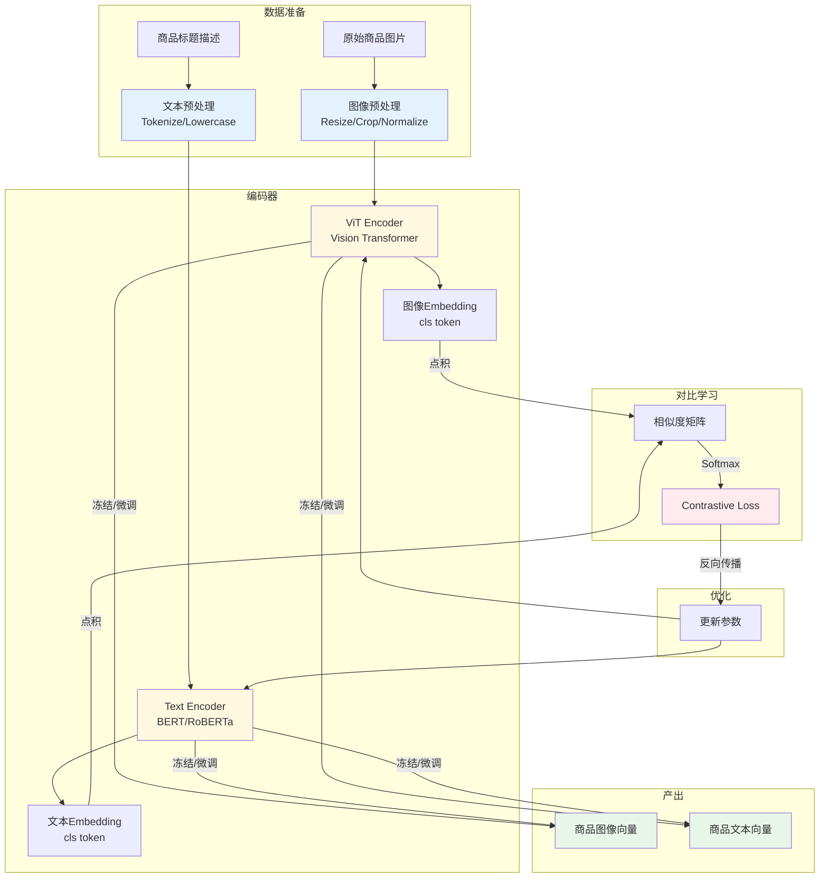
```mermaid
graph TD
    subgraph 数据准备
        RAW_IMG[原始商品图片] --> PREP_IMG[图像预处理<br/>Resize/Crop/Normalize]
        RAW_TEXT[商品标题描述] --> PREP_TEXT[文本预处理<br/>Tokenize/Lowercase]
    end

    subgraph 编码器
        PREP_IMG --> VIT[ViT Encoder<br/>Vision Transformer]
        PREP_TEXT --> BERT[Text Encoder<br/>BERT/RoBERTa]
        VIT --> IMG_EMBED[图像Embedding<br/>cls token]
        BERT --> TEXT_EMBED[文本Embedding<br/>cls token]
    end

    subgraph 对比学习
        IMG_EMBED -->|点积| SIM_MATRIX[相似度矩阵]
        TEXT_EMBED -->|点积| SIM_MATRIX
        SIM_MATRIX -->|Softmax| LOSS[Contrastive Loss]
    end

    subgraph 优化
        LOSS -->|反向传播| UPDATE[更新参数]
        UPDATE --> VIT
        UPDATE --> BERT
    end

    subgraph 产出
        VIT & BERT -->|冻结/微调| PROD_IMG[商品图像向量]
        VIT & BERT -->|冻结/微调| PROD_TEXT[商品文本向量]
    end

    style PREP_IMG fill:#e3f2fd
    style PREP_TEXT fill:#e3f2fd
    style VIT fill:#fff8e1
    style BERT fill:#fff8e1
    style LOSS fill:#ffebee
    style PROD_IMG fill:#e8f5e9
    style PROD_TEXT fill:#e8f5e9
```

---

### 7.2 双塔召回模型架构

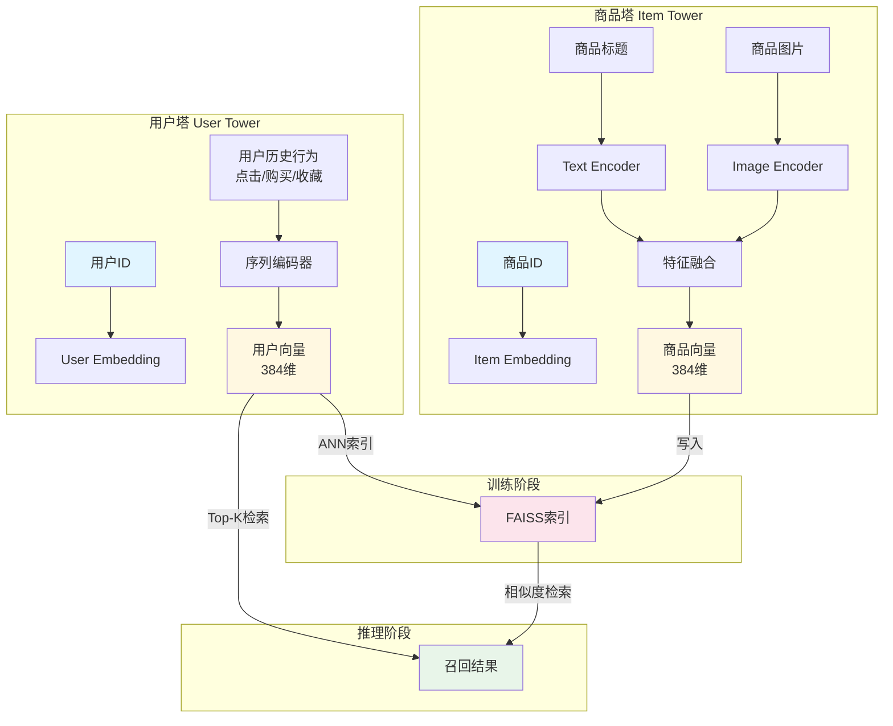
```mermaid
graph TD
    subgraph 用户塔 User Tower
        USER_ID[用户ID] --> USER_EMBED[User Embedding]
        USER_HIST[用户历史行为<br/>点击/购买/收藏] --> SEQ_ENC[序列编码器]
        SEQ_ENC --> USER_VEC[用户向量<br/>384维]
    end

    subgraph 商品塔 Item Tower
        ITEM_ID[商品ID] --> ITEM_EMBED[Item Embedding]
        ITEM_TITLE[商品标题] --> TEXT_ENC[Text Encoder]
        ITEM_IMG[商品图片] --> IMG_ENC[Image Encoder]
        TEXT_ENC & IMG_ENC --> ITEM_FUSION[特征融合]
        ITEM_FUSION --> ITEM_VEC[商品向量<br/>384维]
    end

    subgraph 训练阶段
        USER_VEC -->|ANN索引| FAISS_INDEX[FAISS索引]
        ITEM_VEC -->|写入| FAISS_INDEX
    end

    subgraph 推理阶段
        USER_VEC -->|Top-K检索| RESULT[召回结果]
        FAISS_INDEX -->|相似度检索| RESULT
    end

    style USER_ID fill:#e1f5ff
    style ITEM_ID fill:#e1f5ff
    style USER_VEC fill:#fff8e1
    style ITEM_VEC fill:#fff8e1
    style FAISS_INDEX fill:#fce4ec
    style RESULT fill:#e8f5e9
```

---

### 7.3 DIN深度兴趣网络架构

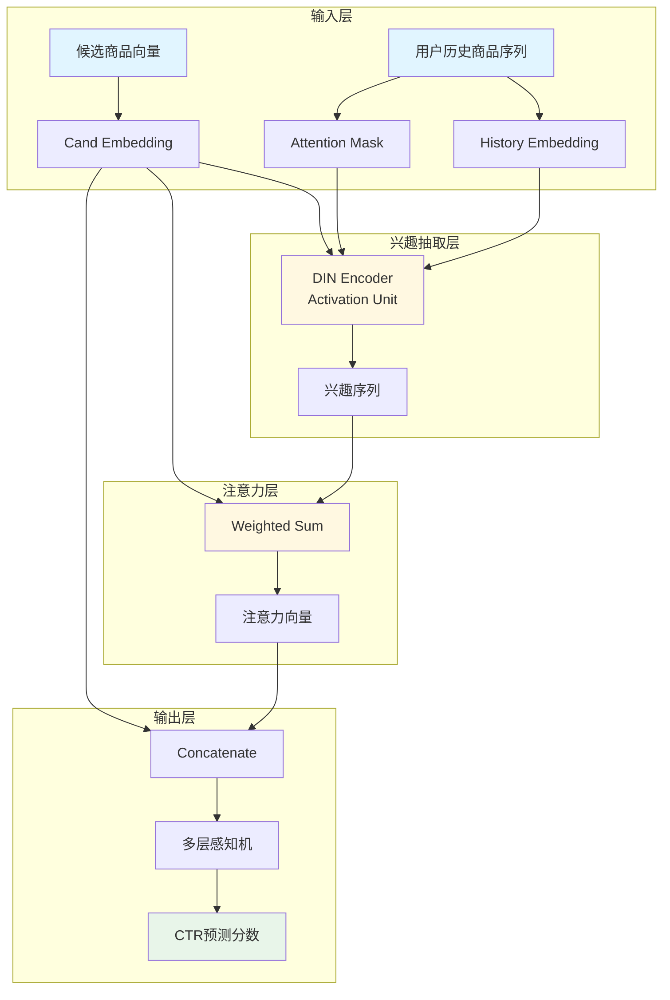
```mermaid
graph TD
    subgraph 输入层
        CAND[候选商品向量] --> CAND_EXP[Cand Embedding]
        HIST_SEQ[用户历史商品序列] --> HIST_EXP[History Embedding]
        HIST_SEQ --> MASK[Attention Mask]
    end

    subgraph 兴趣抽取层
        HIST_EXP --> DIN_ENC[DIN Encoder<br/>Activation Unit]
        CAND_EXP --> DIN_ENC
        MASK --> DIN_ENC
        DIN_ENC --> INTEREST[兴趣序列]
    end

    subgraph 注意力层
        INTEREST --> ATTN_POOL[Weighted Sum]
        CAND_EXP --> ATTN_POOL
        ATTN_POOL --> ATTN_VEC[注意力向量]
    end

    subgraph 输出层
        ATTN_VEC & CAND_EXP --> CONCAT[Concatenate]
        CONCAT --> MLP[多层感知机]
        MLP --> SCORE[CTR预测分数]
    end

    style CAND fill:#e1f5ff
    style HIST_SEQ fill:#e1f5ff
    style DIN_ENC fill:#fff8e1
    style ATTN_POOL fill:#fff8e1
    style SCORE fill:#e8f5e9
```

---

### 7.4 LambdaMART排序模型架构

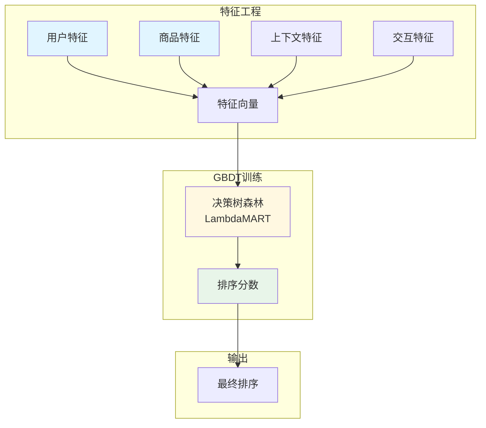
```mermaid
graph TD
    subgraph 特征工程
        USER_FEAT[用户特征] --> FEAT_VEC[特征向量]
        ITEM_FEAT[商品特征] --> FEAT_VEC
        CONTEXT_FEAT[上下文特征] --> FEAT_VEC
        INTERACT_FEAT[交互特征] --> FEAT_VEC
    end

    subgraph GBDT训练
        FEAT_VEC --> TREES[决策树森林<br/>LambdaMART]
        TREES --> RANK_SCORE[排序分数]
    end

    subgraph 输出
        RANK_SCORE --> FINAL_RANK[最终排序]
    end

    style USER_FEAT fill:#e1f5ff
    style ITEM_FEAT fill:#e1f5ff
    style TREES fill:#fff8e1
    style RANK_SCORE fill:#e8f5e9
```

---

### 7.5 Octopus多兴趣建模详细架构

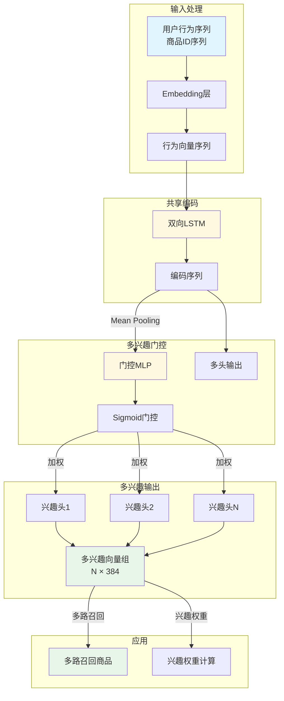
```mermaid
graph TD
    subgraph 输入处理
        BEH_SEQ[用户行为序列<br/>商品ID序列] --> EMBED[Embedding层]
        EMBED --> INPUT_SEQ[行为向量序列]
    end

    subgraph 共享编码
        INPUT_SEQ --> BI_LSTM[双向LSTM]
        BI_LSTM --> ENCODED[编码序列]
    end

    subgraph 多兴趣门控
        ENCODED -->|Mean Pooling| GATE_MLP[门控MLP]
        GATE_MLP --> GATE_SIG[Sigmoid门控]
        ENCODED --> MULTI_HEAD[多头输出]
    end

    subgraph 多兴趣输出
        GATE_SIG -->|加权| HEAD_1[兴趣头1]
        GATE_SIG -->|加权| HEAD_2[兴趣头2]
        GATE_SIG -->|加权| HEAD_N[兴趣头N]
        HEAD_1 & HEAD_2 & HEAD_N --> INTEREST_VECS[多兴趣向量组<br/>N × 384]
    end

    subgraph 应用
        INTEREST_VECS -->|多路召回| RECALL[多路召回商品]
        INTEREST_VECS -->|兴趣权重| WEIGHT[兴趣权重计算]
    end

    style BEH_SEQ fill:#e1f5ff
    style BI_LSTM fill:#fff8e1
    style GATE_MLP fill:#fff8e1
    style INTEREST_VECS fill:#e8f5e9
    style RECALL fill:#e8f5e9
```

---

### 7.6 LLM查询理解详细流程

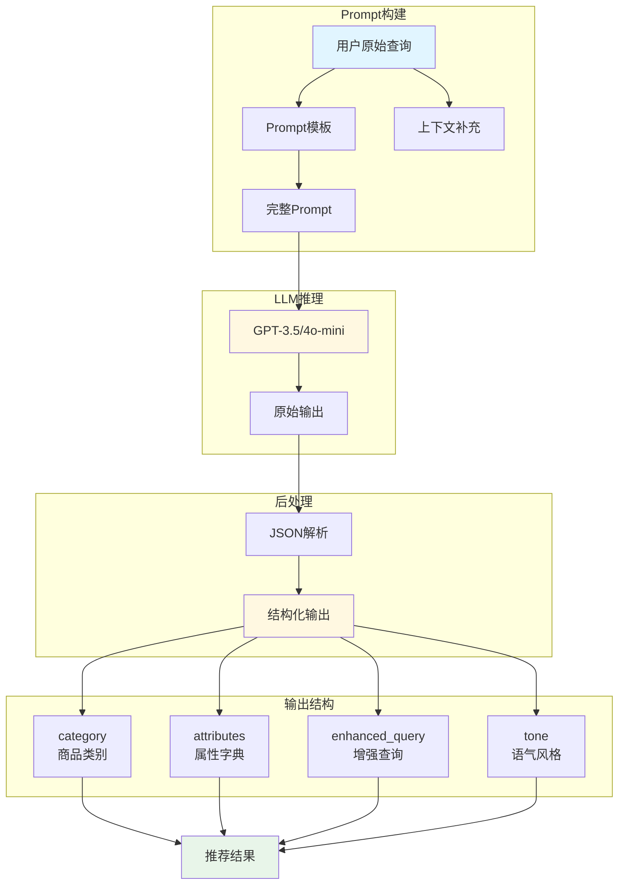
```mermaid
graph TD
    subgraph Prompt构建
        USER_RAW[用户原始查询] --> PROMPT_TMPL[Prompt模板]
        USER_RAW --> CONTEXT[上下文补充]
        PROMPT_TMPL --> FINAL_PROMPT[完整Prompt]
    end

    subgraph LLM推理
        FINAL_PROMPT --> LLM[GPT-3.5/4o-mini]
        LLM --> RAW_OUTPUT[原始输出]
    end

    subgraph 后处理
        RAW_OUTPUT --> JSON_PARSE[JSON解析]
        JSON_PARSE --> STRUCT_OUT[结构化输出]
    end

    subgraph 输出结构
        STRUCT_OUT --> CATEGORY[category<br/>商品类别]
        STRUCT_OUT --> ATTRS[attributes<br/>属性字典]
        STRUCT_OUT --> ENHANCED[enhanced_query<br/>增强查询]
        STRUCT_OUT --> TONE[tone<br/>语气风格]
    end

    CATEGORY & ATTRS & ENHANCED & TONE --> REC_RESULT[推荐结果]

    style USER_RAW fill:#e1f5ff
    style LLM fill:#fff8e1
    style STRUCT_OUT fill:#fff8e1
    style REC_RESULT fill:#e8f5e9
```

---

### 7.7 冷启动推荐流程

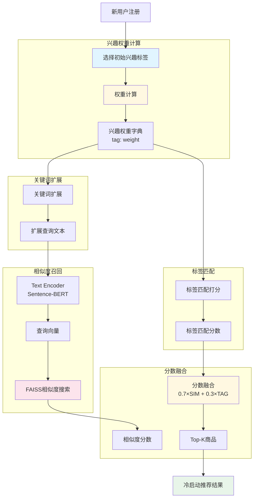
```mermaid
graph TD
    START[新用户注册] --> INTERESTS[选择初始兴趣标签]

    subgraph 兴趣权重计算
        INTERESTS --> WEIGHT_CALC[权重计算]
        WEIGHT_CALC --> INTEREST_WEIGHTS[兴趣权重字典<br/>tag: weight]
    end

    subgraph 关键词扩展
        INTEREST_WEIGHTS --> KEYWORD_EXP[关键词扩展]
        KEYWORD_EXP --> EXPANDED_QUERY[扩展查询文本]
    end

    subgraph 相似度召回
        EXPANDED_QUERY --> TEXT_ENCODER[Text Encoder<br/>Sentence-BERT]
        TEXT_ENCODER --> QUERY_VEC[查询向量]
        QUERY_VEC --> FAISS_SEARCH[FAISS相似度搜索]
    end

    subgraph 标签匹配
        INTEREST_WEIGHTS --> TAG_MATCH[标签匹配打分]
        TAG_MATCH --> TAG_SCORE[标签匹配分数]
    end

    subgraph 分数融合
        FAISS_SEARCH --> SIM_SCORE[相似度分数]
        TAG_SCORE --> FUSION[分数融合<br/>0.7×SIM + 0.3×TAG]
        FUSION --> TOP_K[Top-K商品]
    end

    TOP_K --> RESULT[冷启动推荐结果]

    style INTERESTS fill:#e1f5ff
    style WEIGHT_CALC fill:#fff8e1
    style FAISS_SEARCH fill:#fce4ec
    style FUSION fill:#fff8e1
    style RESULT fill:#e8f5e9
```

---

### 7.8 用户反馈实时更新流程

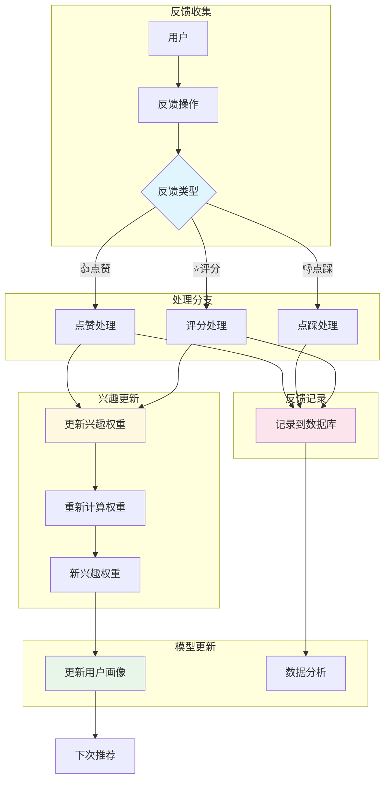
```mermaid
graph TD
    subgraph 反馈收集
        USER[用户] --> FEEDBACK[反馈操作]
        FEEDBACK --> TYPE{反馈类型}
    end

    subgraph 处理分支
        TYPE -->|👍点赞| LIKE_PROC[点赞处理]
        TYPE -->|👎点踩| DISLIKE_PROC[点踩处理]
        TYPE -->|⭐评分| RATE_PROC[评分处理]
    end

    subgraph 兴趣更新
        LIKE_PROC --> UPDATE_WEIGHT[更新兴趣权重]
        RATE_PROC --> UPDATE_WEIGHT
        UPDATE_WEIGHT --> RECALC[重新计算权重]
        RECALC --> NEW_WEIGHTS[新兴趣权重]
    end

    subgraph 反馈记录
        LIKE_PROC --> DB_REC[记录到数据库]
        DISLIKE_PROC --> DB_REC
        RATE_PROC --> DB_REC
    end

    subgraph 模型更新
        NEW_WEIGHTS --> USER_PROFILE[更新用户画像]
        DB_REC --> ANALYTICS[数据分析]
    end

    USER_PROFILE --> NEXT_REC[下次推荐]

    style TYPE fill:#e1f5ff
    style UPDATE_WEIGHT fill:#fff8e1
    style DB_REC fill:#fce4ec
    style USER_PROFILE fill:#e8f5e9
```

---

## 八、核心技术栈

| 层级 | 技术 | 说明 |
|------|------|------|
| **前端展示** | Streamlit | 交互式Web界面 |
| **多模态对齐** | CLIP (ViT-B/32) | 图文语义空间对齐 |
| **向量检索** | FAISS (HNSW) | 高效向量相似度检索 |
| **关键词检索** | BM25 | 稀疏文本检索 |
| **双塔召回** | Twin-Tower | 用户-商品匹配召回 |
| **深度排序** | DIN | 深度兴趣网络 |
| **学习排序** | LambdaMART | 梯度提升排序 |
| **用户建模** | Octopus | 多兴趣表示学习 |
| **意图理解** | GPT-3.5/4o-mini | 自然语言意图解析 |
| **数据存储** | SQLite | 关系型数据存储 |
| **向量存储** | NumPy (.npy) | 高维向量持久化 |

---

## 九、总结

本系统采用了业界先进的推荐系统架构：

1. **多模态对齐**：CLIP 实现图文统一表示
2. **高效召回**：FAISS + BM25 + 双塔的多路召回
3. **精细排序**：DIN + LambdaMART 的集成排序
4. **用户建模**：Octopus 多兴趣表示
5. **智能交互**：LLM 赋能自然语言理解

通过 Streamlit 实现了端到端的交互演示，验证了整套技术的可行性。
---

## 十、2026-04 演示版更新

### 10.1 交互流程更新

系统入口已调整为“先登录，再进入推荐工作台”：

1. 登录页独立展示，不再把登录与搜索混在同一屏。
2. 登录成功后进入主工作台，开放搜索、显性个性化实验台、用户画像三类功能。
3. 退出登录后返回登录页，清空当前会话级聊天与实验结果。

### 10.2 UI 与科技风表现更新

当前前端界面已增加以下视觉层：

1. 全局科技风 CSS：
   - 渐变背景
   - 玻璃拟态卡片
   - 高亮按钮
   - 芯片式指标标签
2. 登录页独立大屏布局：
   - 左侧系统介绍与能力卡片
   - 右侧登录/注册认证面板
3. JavaScript 动态信号面板：
   - 粒子连线
   - 网格扫描背景
   - 动态指标数字
   - 状态短语轮播

### 10.3 显性个性化能力更新

为了让评委老师在演示时“直接看见个性化”，系统新增了显性个性化展示链路：

1. 显性个性化实验台
   - 输入同一条查询
   - 同时输出“通用排序”和“个性化排序”
   - 对比 Top1 是否变化、排序变化商品数、结果重合数
2. 用户画像展示
   - 展示当前用户高权重兴趣标签
   - 显示每个兴趣权重，便于解释为什么推荐会变化
3. 结果解释卡
   - 显示 `Recall / Fusion / Personalization / Negative` 指标
   - 显示“匹配兴趣”“个性化提升”“负向抑制”等解释标签

### 10.4 个性化策略更新

当前个性化已从“仅正向兴趣加权”升级为“正负反馈联合建模”：

1. 正向信号
   - 初始兴趣标签
   - 喜欢
   - 高评分（4-5分）
2. 负向信号
   - 点踩
   - 低评分（1-2分）
3. 排序融合逻辑
   - 基础多模态排序分
   - 兴趣匹配加分
   - 负向偏好抑制分

### 10.5 当前答辩演示建议

推荐按以下顺序现场演示：

1. 使用用户A登录，展示其兴趣画像。
2. 在显性个性化实验台输入固定查询，展示“通用排序 vs 个性化排序”差异。
3. 切换用户B重新执行相同查询，展示同问不同答。
4. 对某个结果执行“点踩”或低评分，再次刷新实验台，展示结果重排变化。

### 10.6 答辩物料生成脚本

当前项目已增加答辩物料生成脚本：

1. `generate_demo_report.py`
2. 作用：
   - 自动创建 3 个答辩测试用户
   - 自动写入初始兴趣与示例反馈
   - 自动生成登录页、用户画像页、显性个性化实验台截图
   - 自动输出阶段成果 Word 文档
   - 自动输出实验数据 JSON

### 10.7 当前答辩测试用户

系统内置了以下演示账号：

1. `demo_fashion / Demo123456`
2. `demo_tech / Demo123456`
3. `demo_home / Demo123456`
